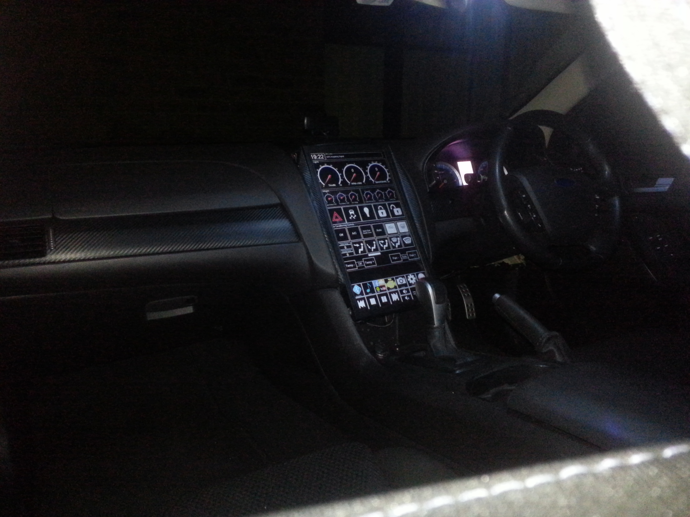
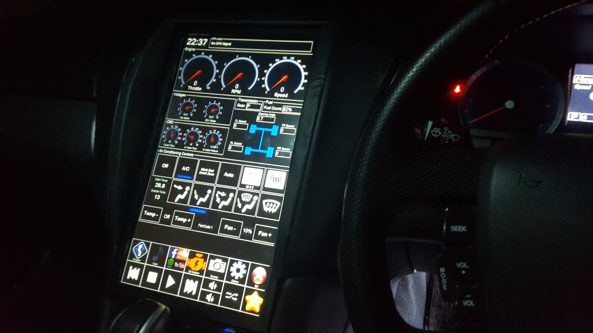

Source for Ford Falcon XR6 FG Car PC Project (Archive).

Directory Index:
Arduino Code -> Code for various Arduino modules (CAN interfaces ect).
CarPC -> GUI Interface for Windows PC / Touchscreen.
CarPCDependencies -> Required dependencies for system.
CarPCMapping -> Convert GPS log data into Google maps view.
CarPCMusicSync -> Sync new music / media files to CarPC.
CarPCServer -> Windows server side service to recieve GPS reports from Car for remote tracking.
Documentation -> CAN Bus information (The best source of FG CANBUS Information can be found on jakka351's page at https://github.com/jakka351/FG-Falcon)

